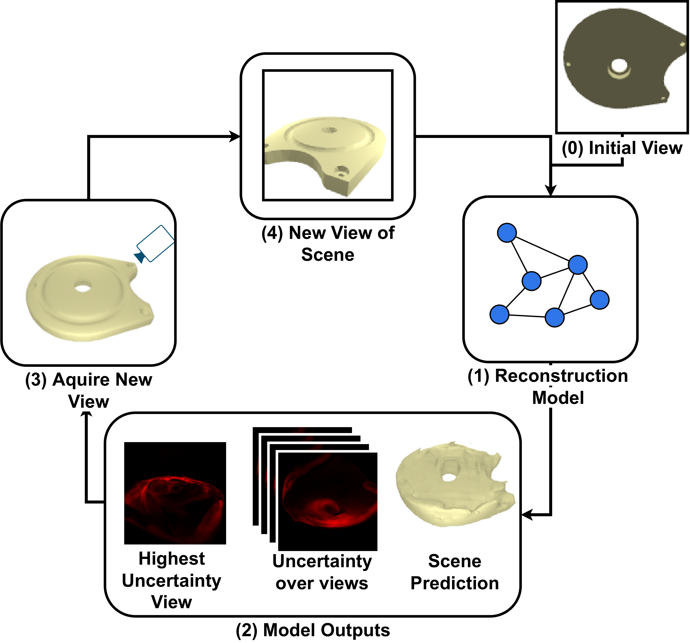
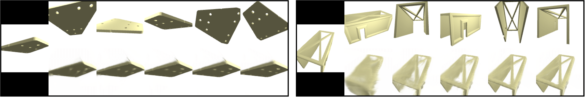
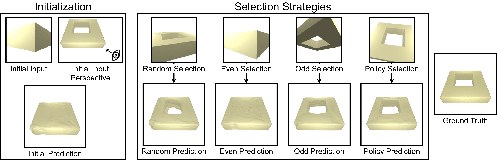

<!---
Copyright (c) Facebook, Inc. and its affiliates.
All rights reserved.
This source code is licensed under the license found in the
LICENSE file in the root directory of this source tree.
-->
## Uncertainty-Driven Active Vision 
Companion code for [Uncertainty-Driven Active Vision for Implicit Scene Reconstruction](https://arxiv.org/abs/2210.00978).

This repository contains the code base for a Next Best View (NBV) task along with our proposed uncertainty driven 
solution and a set of baselines for comparison.  The repo provides a dataset, pretrained models, and training and evaluation scripts.
This code base uses a subset of the [ABC Dataset](https://deep-geometry.github.io/abc-dataset/) (released under MIT License).


<p align="center">
  
</p>


Our approach to NBV works as shown in the image above: (1) a pre-trained shape reconstruction model is fed with an object image; 
(2) the predicted reconstruction is used to estimate the uncertainty over the unseen object views; 
(3) the view with the highest uncertainty acquired and (4) fed to the reconstruction model, which is designed to process an arbitrary number of views.

If you find this code useful in your research, please consider citing with the following BibTeX entry:

```
@misc{smith2022uncertaintydriven,
      title={Uncertainty-Driven Active Vision for Implicit Scene Reconstruction}, 
      author={Edward J. Smith and Michal Drozdzal and Derek Nowrouzezahrai and David Meger and Adriana Romero-Soriano},
      year={2022},
      eprint={2210.00978},
      archivePrefix={arXiv},
      primaryClass={cs.CV}
}

```

### Installation

This code uses Python 3.8 , PyTorch 1.12.1, though this is not strict, and any recent pytorch version should work fine. 
To install all of the dependencies do the following: 

```bash
$ pip install -r requirements.txt
```

### Dataset
To download the dataset call the following, keep in mind this will take some time to download and unpack:
```bash
$ bash download_data.sh
```


### Reconstruction Models 
We provide a reconstruction model which predicts occupancy, and operates with either 3D or 2D supervision. 

#### 3D Supervision 
For the 3D supervision setting, move to the directory repo-location/3D/ . Here you can train by calling: 
```bash
$ python train.py --reset --config ../configs/ABC_3D.yml
```
where the config file provided can be updated to specify futher training and model details. 
By default this trains with 1 to 5 input images.

You can test the trained model by calling: 
```bash
$ python train.py --config ../configs/ABC_3D.yml --eval
```
which will both output the predicted model IoU accuracy and render a set of images. 

You can also evaluate the pretrained model by calling: 
```bash
$ python train.py --config ../configs/ABC_3D_Pretrained.yml --eval
```
Here are some example reconstructions: 
<p align="center">
  
</p>
 
#### 2D Supervision 
For the 2D supervision setting, move to the directory repo-location/2D/ . Here you can train by calling: 
```bash
$ python train.py --reset --config ../configs/ABC_2D.yml
```
where the config file provided can be updated to specify futher training and model details. 
By default this trains with 1 to 5 input images.

You can test the trained model by calling: 
```bash
$ python train.py --config ../configs/ABC_2D.yml --eval
```
which will both output the predicted model IoU accuracy and render a set of images. 

You can also evaluate the pretrained model by calling: 
```bash
$ python train.py --config ../configs/ABC_2D_Pretrained.yml --eval
```

Here are some example reconstructions: 
<p align="center">
  
</p>
 

In all instances you can append the parameters $ --limit_data $ to use significantly less data and speed up training 
and evaluation.


### NBV startegies
We provide scripts for comparing our proposed 'candidate' and 'gradient' policies to baseline 'random', 'even', and 'odd'
policies. 
#### 3D Supervision 
For the 3D supervision setting, move to the directory repo-location/3D/ . Here you can evaluate a by calling: 
```bash
$ python policy_evaluator.py --config ../configs/ABC_3D_NBV.yml
```
where the config file provided can be updated to specify different settings. Importantly you can change the policy to use 
to one of \['candidate', 'gradient', 'random', 'even', 'odd'\]. This eval will display the IoU  perfromance of the policy chosen on the test set. 

Here is an example comparison of the policies: 
<p align="center">
  
</p>


#### 2D Supervision 
For the 2D supervision settingm move to the directory repo-location/2D/ . Here you can evaluate a by calling: 
```bash
$ python policy_evaluator.py --config ../configs/ABC_2D_NBV.yml
```
where the config file provided can be updated to specify different setting. Importantly you can change the policy to use 
to one of \['candidate', 'gradient', 'random', 'even', 'odd'\]. This eval will display the IoU and PSNR performance of the policy chosen on the test set. 


In all instances you can append the parameters $ --limit_data $ to use significantly less data and speed up training 
and evaluation.

### License
See [LICENSE](LICENSE.md) for details.
